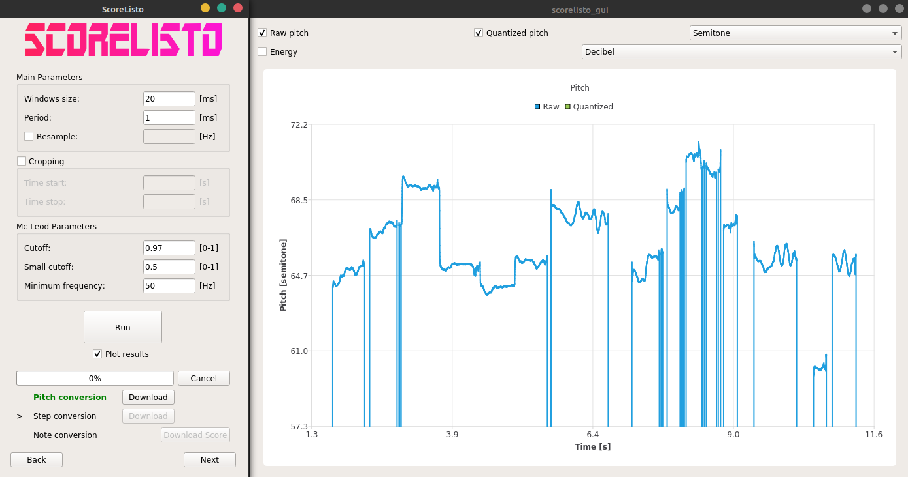

# Unmaintained

# ScoreListo  
C++ library to extract music score from an audio source file (melodies only).  
**THIS PROJECT IS NOT MAINTAINED.**  




It's only working with melody (one note at a time); Chords won't be recognized.  
- Files are opened and resampled using **FFmpeg** library.  
- Pitch detection is performed using **Mc-Leod Pitch method**.  
- Score output format: **Midi** and/or **MusicXML**.  
  
It comes with a simple command line app and a GUI app to perform score extraction using the library.  


# Sources / Libraries used  
- McLeod method: (https://github.com/JorenSix/TarsosDSP/blob/master/src/core/be/tarsos/dsp/pitch/McLeodPitchMethod.java)  
- cxxopts: (https://github.com/jarro2783/cxxopts)  
- ffmpeg: (https://github.com/FFmpeg/FFmpeg)  
- nlohmannjson: (https://github.com/nlohmann/json)  
- Dijkstra algorithm: (https://github.com/mburst/dijkstras-algorithm/)  
- Qt: (https://www.qt.io/)  

# Dependencies (to compile) 
- cmake 3.1+  
- ffmpeg 4.0+  
- Qt 5.??  
- googletest [not mandatory: only if you want to run unit tests]  


# Linux

## Install Dependencies   
### CMake  
```
sudo apt-get install cmake
```  

### ffmpeg  
(Installing by default in '/usr/local/')  
```
git clone https://git.ffmpeg.org/ffmpeg.git ffmpeg
cd ffmpeg
./configure --enable-shared --disable-static
make
sudo make install
```  
In case you only want the required ffmpeg libraries:  
`./configure --disable-avdevice --disable-swscale --disable-postproc --disable-avfilter`  
In case you want to install ffmpeg only for this project:  
`./configure --prefix=/path/to/the/project/third_party/ffmpeg/`  
(You also can use pre compiled packages on debian based distro)  

### Googletest  
Download sources from: https://github.com/google/googletest  
Installing by default in '/usr/local/'  
```
mkdir build && cd build
cmake ..
make
sudo make install
```  
In case you want to install googletest only for this project:  
`cmake -DCMAKE_INSTALL_PREFIX:PATH=/path/to/the/project/third_party/googletest/ ..`  

### Qt
Download and Install Qt from https://www.qt.io/  
Add `Qt5_DIR` to your .profile
`export Qt5_DIR="$HOME/Qt/5.12.7/gcc_64/lib/cmake/Qt5"`  

Following the page: https://wiki.qt.io/Install_Qt_5_on_Ubuntu  
Run the following commands
```
sudo apt-get install mesa-common-dev
sudo apt-get install libglu1-mesa-dev -y
```  
To make it work with the C/C++ for Visual Studio Code:  
1. Ctrl + Shift + p to open command palette  
2. Search for: C/Cpp: Edit Configurations  
3. You should have a new tab called: c_cpp_properties.json  
4. In configurations array you should edit the Linux section  
5. Add your paths in the includePath setting e.g: "/home/user/Qt/5.12.7/gcc_64/include/**"

## Build  
```
mkdir -p build/release
cd build/release
cmake -G 'Unix Makefiles' -DCMAKE_BUILD_TYPE=Release ../..
make
```  
Add `-DBUILD_TESTING=ON` to cmake if you want to build unit testing program.  


# Windows

## Install Dependencies   
### CMake  
- Download and install cmake: https://cmake.org/  
- During the installation select: add cmake to the system path for current/all user  
### ffmpeg  
- Download the dev ffmpeg build from: https://ffmpeg.zeranoe.com/builds/  
- Copy/paste the folders 'lib' and 'include' of the downloaded build in `third_party/ffmpeg` folder  
### Googletest  
Download sources from: https://github.com/google/googletest  
- Open a terminal and `cd` to the main googletest directory  
```
mkdir build & cd build  
cmake -DCMAKE_INSTALL_PREFIX:PATH="C:\path\to\scorelisto\third_party\googletest" -G "Visual Studio 16 2019" ..  
```  
- Open the project with visual studio
- Select **Release** configuration  
- Right click on INSTALL project and click on build  
### Qt  


## Build  
```
mkdir -p build/release
cd build/release
cmake -G "Visual Studio 16 2019" -DCMAKE_BUILD_TYPE=Release ../..
```  
Add `-DBUILD_TESTING=ON` to cmake if you want to build unit testing program.  


# To Do List  
## Important  
- Add BPM information on the output of **RhythmDetector** and in the MusicXml.  
- Implement PitchDetector process function for windows user  
- Set the number of process automatically (for the moment it's fixed at 8)  
- Add a lot of check in the ScoreListoModel  
- Check the license term of each library used, I may have to include these license file in the project  
- use the new QT5 way to connect signals and slots  
- Check where to put include (most possible in cpp, Do I have to duplicate them in cpp and hpp ?)  

## Others  
- Use smart pointer instead of deleting an object then assigning nullptr  
- I think a lot of variable should stay int instead of unsigned etc.. much simpler  
- I catched all C++ exceptions, it is a bad practice.
- Implement a more robust automatic mode detection (Minor / Major) **HeightDetector::findMode**.  
- **StepDetector::maskAutoEnergy()** has to be improved ! It masks too much signal for now.
- Improve the way the **HistogramStepDetector** works: the histogram has to be weighted as a function of standard deviation of the interval. For now, It can create false detection.  
- Check the minimum version of ffmpeg that can be used. 
- Centralise the value of NaN double value and make the possibility to change it to another value.  
- Add Midi output option and Write Tests for **MidiScore**.  
- Write a technical report to explain how does it works, the limits, etc...  
- Improve processing time of the **McLeodPitchExtractorMethod** class.  
- Create a **SoxAudioReader** class using Sox library (http://sox.sourceforge.net/).  
- Rewrite **StepDetector** class prettier.  
- Rewrite **extract_local_min_max** correctly, it's pretty ugly. Maybe a class would be more convenient.  
- Rewrite **FFmpegAudioReader** with the same naming standard I used in the project.  
- Improve the way I search for the prettiest score in **RhythmDetectorgetPrettiestScoreParameters**. Some combinations cut are less/more important than others.  
- Study if the weight calculation for the Dijkstra graph edges is optimal (**CombinationFinder::calculateError**).  
- Choose the gaussian width as a function of the minimum note height gap in **HistogramStepDetector**.  
- **HistogramStepDetector::DeleteNoteTooClose** should be changed because notes shouldn't be deleted if the gaussian width is choose correctly. If 2 notes are still to close to each other, maybe averaging both would be a better solution than deleting one ?  
- If the input energy in **HistogramStepDetector** is NaN, update it to 0.  
- Use more templates
- When detecting height of the note, I could give a weight to each height by its corresponding energy + the standard deviation of its surrounding  
# Questioning
- Would it be better to use namesapce for each part of the library ?  
- Should I use more std::tuple as returned value ?  
- Should I add logs ?  
- What should I do if the input energy vector in **HistogramStepDetector** contains NaN ? update it to 0 ?  
- Could I change the convolution in the **HistogramStepDetector** with **GaussianKde** by using custom bandwidth ?  
